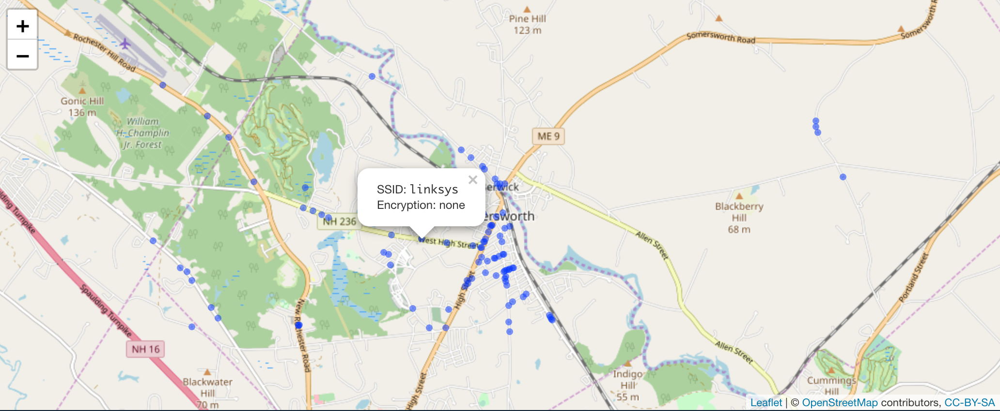

```{r pkg-knitr-opts, include=FALSE}
knitr::opts_chunk$set(collapse=TRUE, fig.retina=2, message=FALSE, warning=FALSE, out.width="100%")
options(width=120)
```

[](https://travis-ci.org/hrbrmstr/wiglr) 
[](https://codecov.io/gh/hrbrmstr/wiglr)
[](https://cran.r-project.org/package=wiglr)

# wiglr

Query and Submit Wi-Fi and Cellular Network Information on 'WiGLE'

## Description

'WiGLE' consolidates location and information of wireless networks world-wide to a central database, and has both a user-friendly desktop+web application plus rich API that can map, query and update the location database. Non-commerical use of the data is bound by the 'WiGLE' EULA <https://wigle.net/eula.html>. Use of the API requires a 'WiGLE' API key <https://wigle.net/account>.

## What's Inside The Tin

The following functions are implemented:

- `wigle_about_me`:	Get WiGLE user object for the current logged-in user
- `wigle_api_key`:	Get or set WIGLE_API_KEY value
- `wigle_bbox_search`:	Get WiGLE named map of general statistics
- `wigle_country_stats`:	Get WiGLE statistics organized by country
- `wigle_region_stats`:	Get WiGLE statistics for a specified country, organized by region
- `wigle_site_stats`:	Get WiGLE named map of general statistics

## Installation

```{r install-ex, eval=FALSE}
devtools::install_git("https://sr.ht.com/~hrbrmstr/wiglr.git")
# or
devtools::install_git("https://gitlab.com/hrbrmstr/wiglr.git")
# or (if you must)
devtools::install_github("hrbrmstr/wiglr")
```

## Usage

```{r lib-ex}
library(wiglr)
library(hrbrthemes)
library(tidyverse) # for show
# current version
packageVersion("wiglr")

```

### Country Stats

```{r country-stats-01, cache=TRUE}
cc <- wigle_country_stats()
```

```{r country-stats-02, fig.width=8, fig.height=6}
top_n(cc, 20) %>%  # show top 20 
  mutate(country = factor(country, levels = rev(country))) %>% 
  ggplot(aes(count, country)) +
  geom_segment(aes(xend=0, yend=country), size = 6, color = ft_cols$blue) +
  scale_x_comma(position = "top") +
  labs(
    x = "# Networks", y = NULL,
    title = "WiGLE Top 20 Countries"
  ) +
  theme_ipsum_rc(grid = "X")
```

### Bounding-box Search (WIP)

Not all the parameters are supported yet and you must paginate on your own for now.

```{r geo-stats-0, cache=TRUE}
wifi_box <- wigle_bbox_search(43.2468, 43.2806, -70.9282, -70.8025)
```

We received 100 records out of `totalResults` of `r wifi_box$totalResults`. 
Use `search_after` in subsequent calls to get the next page. The `results` slot
holds the data.

```{r geo-stats-1}
knitr::kable(
  head(wifi_box$results, 20)
)
```

Map them!

```{r geo-stats-2, fig.width=10, fig.height=6, cache=TRUE}
ggplot(wifi_box$results, aes(trilong, trilat)) + 
  geom_point() +
  ggrepel::geom_label_repel(
    aes(label = ssid), size = 2, family = font_rc
  ) + 
  coord_quickmap() +
  labs(
    x = NULL, y = NULL,
    title = "WiGLE Quickmap of First 100 Results"
  ) +
  theme_ipsum_rc(grid = "XY")
```

Make your own WiGLE interactive map by running this at home:

```{r leaf, eval=FALSE}
library(leaflet)

wifi_box$results %>% 
  mutate(labs = sprintf("SSID: <code>%s</code><br/>Encryption: %s", ssid, encryption)) %>% 
  leaflet() %>% 
  addTiles() %>% 
  addCircleMarkers(~trilong, ~trilat, radius = 1, popup = ~labs)
```



## wiglr Metrics

```{r cloc, echo=FALSE}
cloc::cloc_pkg_md()
```

## Code of Conduct

Please note that this project is released with a [Contributor Code of Conduct](CONDUCT.md). 
By participating in this project you agree to abide by its terms.
