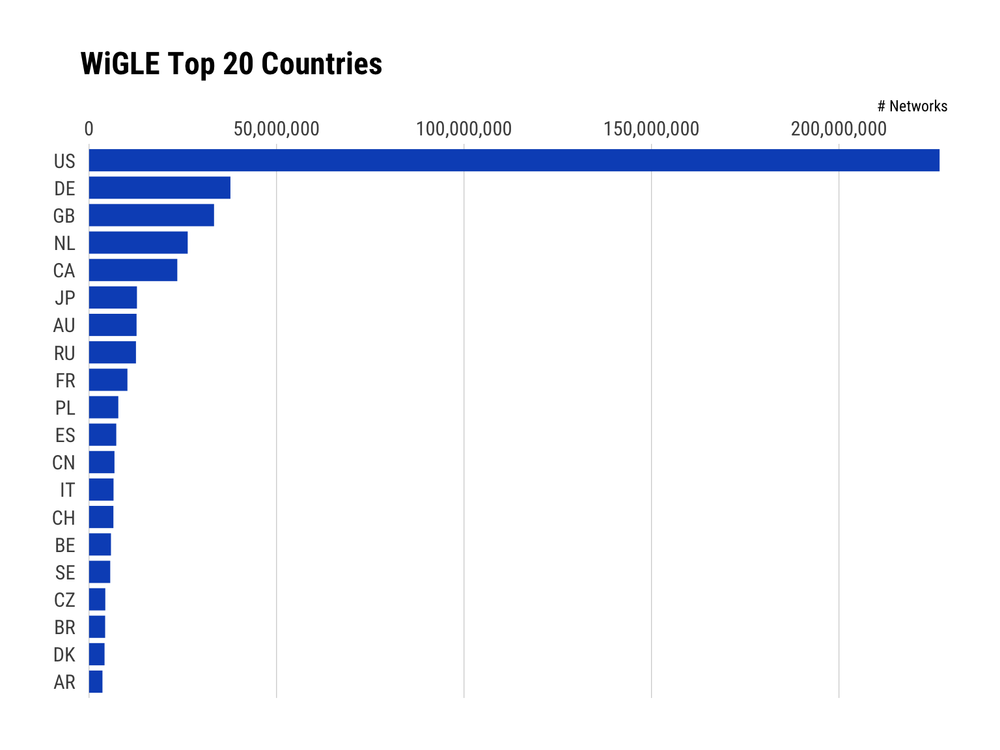

[](https://travis-ci.org/hrbrmstr/wiglr)
[](https://codecov.io/gh/hrbrmstr/wiglr)
[](https://cran.r-project.org/package=wiglr)

# wiglr

Query and Submit Wi-Fi and Cellular Network Information on ‘WiGLE’

## Description

‘WiGLE’ consolidates location and information of wireless networks
world-wide to a central database, and has both a user-friendly
desktop+web application plus rich API that can map, query and update the
location database. Non-commerical use of the data is bound by the
‘WiGLE’ EULA <https://wigle.net/eula.html>. Use of the API requires
a ‘WiGLE’ API key <https://wigle.net/account>.

## What’s Inside The Tin

The following functions are implemented:

  - `wigle_about_me`: Get WiGLE user object for the current logged-in
    user
  - `wigle_api_key`: Get or set WIGLE\_API\_KEY value
  - `wigle_bbox_search`: Get WiGLE named map of general statistics
  - `wigle_country_stats`: Get WiGLE statistics organized by country
  - `wigle_region_stats`: Get WiGLE statistics for a specified country,
    organized by region
  - `wigle_site_stats`: Get WiGLE named map of general statistics

## Installation

``` r
devtools::install_git("https://sr.ht.com/~hrbrmstr/wiglr.git")
# or
devtools::install_git("https://gitlab.com/hrbrmstr/wiglr.git")
# or (if you must)
devtools::install_github("hrbrmstr/wiglr")
```

## Usage

``` r
library(wiglr)
library(hrbrthemes)
library(tidyverse) # for show
# current version
packageVersion("wiglr")
## [1] '0.1.0'
```

### Country Stats

``` r
cc <- wigle_country_stats()
```

``` r
top_n(cc, 20) %>%  # show top 20 
  mutate(country = factor(country, levels = rev(country))) %>% 
  ggplot(aes(count, country)) +
  geom_segment(aes(xend=0, yend=country), size = 6, color = ft_cols$blue) +
  scale_x_comma(position = "top") +
  labs(
    x = "# Networks", y = NULL,
    title = "WiGLE Top 20 Countries"
  ) +
  theme_ipsum_rc(grid = "X")
```



### Bounding-box Search (WIP)

Not all the parameters are supported yet and you must paginate on your
own for now.

``` r
wifi_box <- wigle_bbox_search(43.2468, 43.2806, -70.9282, -70.8025)
```

We received 100 records out of `totalResults` of 15455. Use
`search_after` in subsequent calls to get the next page. The `results`
slot holds the data.

``` r
knitr::kable(
  head(wifi_box$results, 20)
)
```

|   trilat |    trilong | ssid                   | qos | transid        | channel | firsttime                | lasttime                 | lastupdt                 | housenumber | road                | city        | region | country | netid             | name | type  | comment | wep | bcninterval | freenet | dhcp | paynet | userfound | encryption |
| -------: | ---------: | :--------------------- | --: | :------------- | ------: | :----------------------- | :----------------------- | :----------------------- | :---------- | :------------------ | :---------- | :----- | :------ | :---------------- | :--- | :---- | :------ | :-- | ----------: | :------ | :--- | :----- | :-------- | :--------- |
| 43.26460 | \-70.86417 | punch it margeret      |   0 | 20120524-00000 |       6 | 2012-05-14T08:00:00.000Z | 2012-05-24T08:00:00.000Z | 2012-05-24T06:00:00.000Z |             | Market Street       | Somersworth | NH     | US      | 00:22:75:94:5A:BD | NA   | infra | NA      | 2   |           0 | ?       | ?    | ?      | FALSE     | wpa2       |
| 43.25858 | \-70.87215 | stef                   |   0 | 20110330-00000 |      10 | 2011-03-31T00:00:00.000Z | 2011-03-30T23:00:00.000Z | 2011-03-30T21:00:00.000Z |             | West High Street    | Somersworth | NH     | US      | 00:22:75:21:8D:0E | NA   | infra | NA      | W   |           0 | ?       | ?    | ?      | FALSE     | wpa        |
| 43.26314 | \-70.86438 | NA                     |   0 | 20110826-00000 |       0 | 2011-08-26T16:00:00.000Z | 2011-08-26T16:00:00.000Z | 2011-08-26T14:00:00.000Z |             | High Street         | Somersworth | NH     | US      | 00:22:6B:8F:F0:86 | NA   | data  | NA      | ?   |           0 | ?       | ?    | ?      | FALSE     | unknown    |
| 43.25513 | \-70.86546 | LandL                  |   0 | 20110616-00000 |      11 | 2011-06-15T00:00:00.000Z | 2011-07-13T06:00:00.000Z | 2011-07-13T04:00:00.000Z |             | South Street        | Somersworth | NH     | US      | 00:22:6B:9B:94:59 | NA   | ????  | NA      | Y   |           0 | ?       | ?    | ?      | FALSE     | wep        |
| 43.26229 | \-70.86689 | gojira                 |   0 | 20110616-00000 |       3 | 2011-06-15T00:00:00.000Z | 2011-07-13T06:00:00.000Z | 2011-07-13T04:00:00.000Z |             | Highland Street     | Somersworth | NH     | US      | 00:22:75:ED:DB:29 | NA   | ????  | NA      | Y   |           0 | ?       | ?    | ?      | FALSE     | wep        |
| 43.26270 | \-70.86474 | NA                     |   0 | 20110616-00000 |       0 | 2011-06-15T00:00:00.000Z | 2011-06-16T00:00:00.000Z | 2011-07-13T04:00:00.000Z |             | High Street         | Somersworth | NH     | US      | 00:22:BD:9B:E4:25 | NA   | ????  | NA      | ?   |           0 | ?       | ?    | ?      | FALSE     | unknown    |
| 43.25229 | \-70.87105 | NA                     |   0 | 20110826-00000 |       0 | 2011-08-26T16:00:00.000Z | 2011-08-26T16:00:00.000Z | 2011-08-26T14:00:00.000Z |             | High Street         | Somersworth | NH     | US      | 00:22:B7:5A:FA:04 | NA   | data  | NA      | ?   |           0 | ?       | ?    | ?      | FALSE     | unknown    |
| 43.25383 | \-70.91891 | Patriots               |   7 | 20110202-00000 |      11 | 2011-02-01T20:00:00.000Z | 2011-09-14T23:00:00.000Z | 2011-09-14T21:00:00.000Z |             | Old Rochester Road  | Somersworth | NH     | US      | 00:22:6B:3F:EA:2B | NA   | infra | NA      | 2   |           0 | ?       | ?    | ?      | FALSE     | wpa2       |
| 43.26962 | \-70.91033 | SumnerCountryOpenWIFI  |   4 | 20120310-00000 |       0 | 2012-03-10T14:00:00.000Z | 2013-03-24T06:00:00.000Z | 2013-03-24T04:00:00.000Z |             | New Rochester Road  | Somersworth | NH     | US      | 00:22:3F:90:72:63 | NA   | infra | NA      | N   |           0 | ?       | ?    | ?      | FALSE     | none       |
| 43.25365 | \-70.85984 | amerofamily3kids       |   3 | 20110907-00000 |       2 | 2011-09-07T15:00:00.000Z | 2013-05-18T19:00:00.000Z | 2013-05-18T17:00:00.000Z |             | Mount Auburn Street | Somersworth | NH     | US      | 00:22:3F:9E:D8:B8 | NA   | infra | NA      | 2   |           0 | ?       | ?    | ?      | FALSE     | wpa2       |
| 43.26198 | \-70.86599 | NA                     |   0 | 20110616-00000 |       0 | 2011-06-15T00:00:00.000Z | 2011-06-16T00:00:00.000Z | 2011-07-13T04:00:00.000Z |             | Highland Street     | Somersworth | NH     | US      | 00:22:4B:FB:E5:25 | NA   | ????  | NA      | ?   |           0 | ?       | ?    | ?      | FALSE     | unknown    |
| 43.24771 | \-70.87181 | TATRO                  |   2 | 20110616-00000 |      10 | 2011-06-15T00:00:00.000Z | 2013-05-18T19:00:00.000Z | 2013-05-18T17:00:00.000Z |             | Indigo Hill Road    | Somersworth | NH     | US      | 00:22:75:CF:26:8E | NA   | infra | NA      | W   |           0 | ?       | ?    | ?      | FALSE     | wpa        |
| 43.26720 | \-70.86248 | WONDERLAND\_Network\_1 |   4 | 20110826-00000 |      10 | 2011-08-26T16:00:00.000Z | 2017-08-05T21:00:00.000Z | 2017-08-05T21:00:00.000Z |             | School Street       |             | ME     | US      | 00:22:75:A7:14:72 | NA   | infra | NA      | 2   |           0 | ?       | ?    | ?      | FALSE     | wpa2       |
| 43.24984 | \-70.87968 | NA                     |   0 | 20110616-00000 |       0 | 2011-06-15T00:00:00.000Z | 2011-06-16T00:00:00.000Z | 2011-07-13T04:00:00.000Z |             | Maple Street        | Somersworth | NH     | US      | 00:23:17:1F:1A:9C | NA   | ????  | NA      | ?   |           0 | ?       | ?    | ?      | FALSE     | unknown    |
| 43.26108 | \-70.86581 | NA                     |   0 | 20110616-00000 |       0 | 2011-06-15T00:00:00.000Z | 2011-06-16T00:00:00.000Z | 2011-07-13T04:00:00.000Z |             | Grove Street        | Somersworth | NH     | US      | 00:22:6B:E9:E5:84 | NA   | ????  | NA      | ?   |           0 | ?       | ?    | ?      | FALSE     | unknown    |
| 43.26185 | \-70.86530 | NA                     |   0 | 20110616-00000 |       0 | 2011-06-15T00:00:00.000Z | 2011-06-16T00:00:00.000Z | 2011-07-13T04:00:00.000Z | 63          | High Street         | Somersworth | NH     | US      | 00:22:6B:E8:D0:32 | NA   | ????  | NA      | ?   |           0 | ?       | ?    | ?      | FALSE     | unknown    |
| 43.25727 | \-70.86382 | linksys                |   0 | 20120524-00000 |       6 | 2012-05-14T08:00:00.000Z | 2012-05-24T08:00:00.000Z | 2012-05-24T06:00:00.000Z |             | Franklin Street     | Somersworth | NH     | US      | 00:22:6B:5B:3E:ED | NA   | infra | NA      | N   |           0 | ?       | ?    | ?      | FALSE     | none       |
| 43.26108 | \-70.86581 | NA                     |   0 | 20110616-00000 |       0 | 2011-06-15T00:00:00.000Z | 2011-06-16T00:00:00.000Z | 2011-07-13T04:00:00.000Z |             | Grove Street        | Somersworth | NH     | US      | 00:22:6B:CB:FE:53 | NA   | ????  | NA      | ?   |           0 | ?       | ?    | ?      | FALSE     | unknown    |
| 43.26314 | \-70.86438 | NA                     |   0 | 20110826-00000 |       0 | 2011-08-26T16:00:00.000Z | 2011-08-26T16:00:00.000Z | 2011-08-26T14:00:00.000Z |             | High Street         | Somersworth | NH     | US      | 00:22:69:D9:C0:EB | NA   | data  | NA      | ?   |           0 | ?       | ?    | ?      | FALSE     | unknown    |
| 43.24929 | \-70.87279 | linksys                |   3 | 20110324-00000 |       6 | 2011-03-24T02:00:00.000Z | 2013-09-13T17:00:00.000Z | 2013-09-13T15:00:00.000Z |             | High Street         | Somersworth | NH     | US      | 00:22:6B:57:C4:49 | NA   | infra | NA      | N   |           0 | ?       | ?    | ?      | FALSE     | none       |

Map them\!

``` r
ggplot(wifi_box$results, aes(trilong, trilat)) + 
  geom_point() +
  ggrepel::geom_label_repel(
    aes(label = ssid), size = 2, family = font_rc
  ) + 
  coord_quickmap() +
  labs(
    x = NULL, y = NULL,
    title = "WiGLE Quickmap of First 100 Results"
  ) +
  theme_ipsum_rc(grid = "XY")
```


Make your own WiGLE interactive map by running this at home:

``` r
library(leaflet)

wifi_box$results %>% 
  mutate(labs = sprintf("SSID: <code>%s</code><br/>Encryption: %s", ssid, encryption)) %>% 
  leaflet() %>% 
  addTiles() %>% 
  addCircleMarkers(~trilong, ~trilat, radius = 1, popup = ~labs)
```


## wiglr Metrics

| Lang | \# Files |  (%) | LoC |  (%) | Blank lines |  (%) | \# Lines |  (%) |
| :--- | -------: | ---: | --: | ---: | ----------: | ---: | -------: | ---: |
| R    |       11 | 0.92 | 180 | 0.81 |          36 | 0.54 |       74 | 0.56 |
| Rmd  |        1 | 0.08 |  42 | 0.19 |          31 | 0.46 |       58 | 0.44 |

## Code of Conduct

Please note that this project is released with a [Contributor Code of
Conduct](CONDUCT.md). By participating in this project you agree to
abide by its terms.
